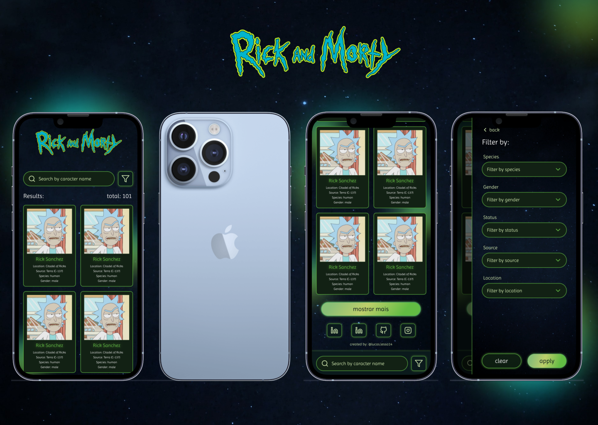

<h1 style="color: #333" align="center">Rick and Morty</h1>

[](https://nodejs.org/)
[](https://angular.io/)
[](https://www.npmjs.com/)
[](https://www.typescriptlang.org/)
[](https://rxjs.dev/)



## 📋 Project

An innovative project that consumes the Rick and Morty public API to display character data in a universe-themed design.

## 🖥️ Technologies

The project was developed using the following technologies:

- <a href="https://nodejs.org/en/">Node.js</a>
- <a href="https://angular.io/">Angular</a>
- <a href="https://www.typescriptlang.org/">TypeScript</a>
- <a href="https://karma-runner.github.io/latest/index.html">Karma</a>
- <a href="https://jasmine.github.io/">Jasmine</a>
- <a href="https://rxjs.dev/">RxJS</a>

## 🚀 How to Run

Make sure you have Node.js and npm installed on your machine. Then follow the steps below:

1. Clone the repository:
   ```bash
   git clone https://github.com/your-username/universe-rick-and-morty.git
   ```

2. Navigate to the project directory:
   ```bash
   cd universe-rick-and-morty
   ```

3. Install dependencies:
   ```bash
   npm install
   ```

4. Start the application:
   ```bash
   npm run start
   ```
5. Open your browser and go to http://localhost:4200/ to view the project.

## 💭 Resources
- Angular CLI: https://angular.io/cli
- Rick and Morty API: https://rickandmortyapi.com/

## ☕ Contributions
Contributions are welcome! Feel free to open issues or pull requests.

## 🔒 License
This project is licensed under the MIT License.
